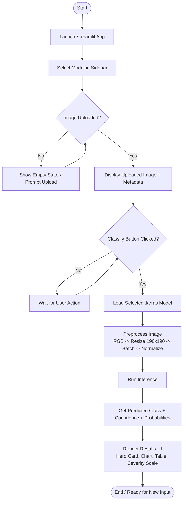

# VehicleDX

VehicleDX is a Streamlit proof-of-concept for classifying vehicle damage severity (Class 1 to Class 5) for insurance claim triage.

## Features
- Upload a vehicle damage image (`jpg`, `jpeg`, `png`)
- Run inference with a fine-tuned CNN model
- View predicted class, confidence, and probability distribution
- See an insurance-oriented severity interpretation panel

## Project Structure
```text
VehicleDX/
  app.py
  style.css
  requirements.txt
  models/
    mobilenetv2_finetuned_best.keras
    densenet121_finetuned_best.keras   # optional unless you want both models
```

## Requirements
- Python 3.10+ (3.13 also works in your current setup)
- pip

Install dependencies:
```bash
pip install -r requirements.txt
```

## Model Files
Place model files in the `models/` directory:
- `models/mobilenetv2_finetuned_best.keras`
- `models/densenet121_finetuned_best.keras` (if you want to use DenseNet121 option)

If a selected model file is missing, the app shows a clear `Model file not found` message.

## Run the App
From the project root:
```bash
streamlit run app.py
```

Then open the local URL shown in terminal (usually `http://localhost:8501`).

## Usage
1. Choose a model in the sidebar.
2. Upload an image of a damaged vehicle.
3. Click `Classify Damage`.
4. Review class prediction, confidence, and severity scale.

## Activity Diagram


## Inference Flowchart
```mermaid
flowchart LR
    U[User Uploads Image] --> P1[Image.open()]
    P1 --> P2[Convert to RGB]
    P2 --> P3[Resize to 190x190]
    P3 --> P4[Convert to float32 ndarray]
    P4 --> P5[Add batch dimension]
    P5 --> P6[Model-specific preprocess_input]
    P6 --> M[Selected Keras Model]
    M --> O[Prediction Vector]
    O --> A[argmax -> class index]
    O --> C[max prob -> confidence]
    A --> R[Severity Mapping\nClass 1..5]
    C --> R
    R --> V[Visual Output\nCards + Bars + Table + Chart]
```

## GitHub and Large Model Files
If your `.keras` files are large, use Git LFS:
```bash
git lfs install
git lfs track "*.keras"
git add .gitattributes
git add models/*.keras
git commit -m "Track and add Keras model files"
git push
```

## Troubleshooting
- `TensorFlow is not installed`: run `pip install tensorflow`
- Sidebar toggle not showing: restart Streamlit and hard-refresh browser
- `Model file not found`: verify filename and location under `models/`

## Disclaimer
This is an academic proof-of-concept. Predictions are preliminary and should not replace professional vehicle inspection or formal claim assessment workflows.
